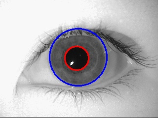

# Iris Extraction

| Input | Pupil Detection | Iris Detection |
| :---: | :---: | :---: |
|  |  |  |

| Iris Segmentation | Iris Bounding Box | Normalization |
| :---: | :---: | :---: |
|  |  |  |

## Requirements

| Python Library | Version |
| :---: | :---: |
| numpy | 1.18.1 |
| opencv-python | 4.4.0.46 |
| matplotlib | 3.0.3 |

## Running

```$ python3 iris_extraction.py <input image> [-p] [-s]```

### Args

* **input image** (*required*): path to the grayscale input image.
* **plot** (*optional*): if `-p` or `--plot` is used, the resulting images will be shown on the screen.
* **save** (*optional*): if `-s` or `--save` is used, the resulting images will be saved as JPG files.

## Testing

I used samples from the MMU iris database to test the code.
You can find the database on [Kaggle](https://www.kaggle.com/naureenmohammad/mmu-iris-dataset).

## References

John Daugman. **How Iris Recognition Works**. IEEE Transactions on Circuits and Systems for Video Technology, vol. 14, no. 1, 2004.
[Link](https://www.cl.cam.ac.uk/~jgd1000/csvt.pdf).

Shireen Y. Elhabian. **Iris Recognition**. University of Lousiville, CVIP Lab, 2009.
[Link](http://www.sci.utah.edu/~shireen/pdfs/tutorials/Elhabian_Iris09.pdf).

OpenCV. **Hough Circle Transform**. 
[Link](https://docs.opencv.org/3.4/d4/d70/tutorial_hough_circle.html).

OpenCV. **connectedComponentsWithStats**.
[Link](https://docs.opencv.org/3.4/d3/dc0/group__imgproc__shape.html#ga107a78bf7cd25dec05fb4dfc5c9e765f).

Wikipedia. **Polar Coordinate System**.
[Link](https://en.wikipedia.org/wiki/Polar_coordinate_system).

Cheng Yifeng. **IrisReco**. GitHub repo.
[Link](https://github.com/YifengChen94/IrisReco).

M. Vinicius Junqueira. **IrisRecognition**. GitHub repo.
[Link](https://github.com/mvjq/IrisRecognition).

Qingbao Guo. **Iris**. GitHub repo.
[Link](https://github.com/Qingbao/iris).
